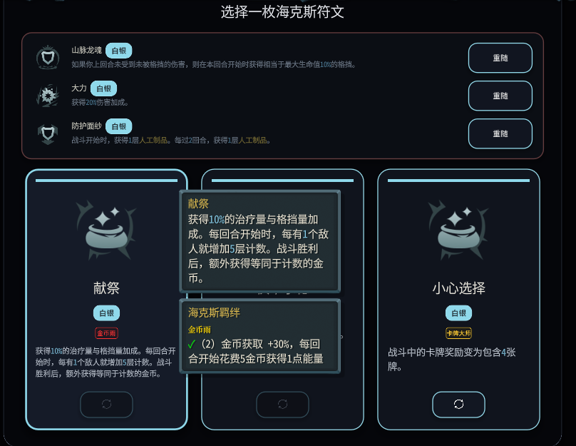
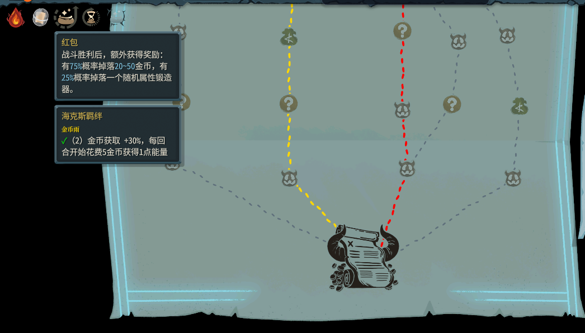

# 📊 SlayTheSpire2-HextechRunes-synergy

> 为《杀戮尖塔 2》海克斯符文 Mod 设计的羁绊/特质系统 —— 参考云顶之弈羁绊机制，收集同路线符文触发组合效果。

---

## 项目简介

本项目在原作者 [Natsuki](https://github.com/Natsuki) 的 **海克斯符文** Mod 基础上，新增了 **羁绊/特质（Synergy）系统**。玩家收集同一羁绊的符文即可触发强力组合效果，为符文选择增加策略深度。

> - 🧩 **原始 Mod**：海克斯符文 v0.5.5（原作者 Natsuki）
> - ⚙️ **本仓库**：羁绊系统框架 + 权重加成 + 门槛预览等配套机制，基于 Hextech Synergy Builder 技能构建

---

## 项目特点

- 🎯 **凑羁绊玩法** —— 收集同一羁绊的符文即可激活组合效果，为符文选择增加策略维度
- 🧬 **多羁绊路线** —— 涵盖经济、成长、叠层、Debuff、攻击、法术等多种打法风格
- ⚖️ **权重加成机制** —— 拥有某羁绊 1 枚符文时，同羁绊符文后续出现权重提升至 **3 倍**；拥有 2 枚且该羁绊有 3 件门槛时提升至 **5 倍**
- 👁️ **门槛预览系统** —— 符文选择界面实时展示羁绊进度（✓/○），并可预览"选择此符文后的状态"
- 🗺️ **全地图悬浮提示** —— 任意已拥有符文上悬浮即可查看羁绊进度与门槛详情
- 🏷️ **彩色羁绊徽章** —— 符文卡片上显示颜色徽章：🔴已激活 / 🟡进行中 / 🟢未触发
- 👥 **多人联机同步** —— 脏标记自动重算 + 稳定随机种子保证联机一致性
- 📐 **标准化扩展** —— 以金币雨为模板，新增羁绊只需定义符文类型列表和阈值效果
- 🎮 **LOL 经典元素融合** —— 深度还原英雄联盟斗魂竞技场锻体成长、云顶之弈收菜羁绊等经典玩法，在杀戮尖塔中体验双重乐趣
- 🏛️ **Act 4 建筑师支持** —— 完美兼容第四幕「最终攀登」内容，支持建筑师事件选择、共享投票机制、地图路线扩展及战斗数值平衡，确保羁绊系统在 Act 4 中正常运行
- ⚡ **多项数值平衡** —— 难度提升，怪物海克斯数量增加，拒绝无脑爽，让每一场战斗都充满策略与抉择，如果你害怕选择移除怪物海克斯，你也要接受一些损失。
  
---

## 🎯 羁绊列表

> 游戏中目前包含 **11 条羁绊**，收集对应符文即可激活羁绊效果。

- 💰 **金币雨**（7 枚符文）—— 经济永动机，以金币换能量
- 🎲 **掷骰狂人**（4 枚符文）—— 随机掉落高阶锻造器
- 🔥 **锻体熔炉**（7 枚符文）—— 属性百分比成长，越叠越强
- 🐉 **叠角龙**（6 枚符文）—— 自动叠层，战斗后额外加层
- 💀 **苦痛回响**（11 枚符文）—— Debuff 流，负面效果连环触发
- 🗿 **小巨人**（9 枚符文）—— 堆血量减伤，巨人苏醒爆发
- ⚔️ **决斗大师**（7 枚符文）—— 攻击牌羁绊，风暴连击
- 🔮 **大法师**（6 枚符文）—— 法术系羁绊，高费触发减费
- 🐲 **远古龙魂**（5 枚符文）—— 龙魂体系，强化龙魂牌效果
- 🎁 **赏金猎人**（11 枚符文）—— 抽牌换宝箱，云顶赏金机制
- 🃏 **命运之子**（5 枚符文）—— 幸运向，奖励卡牌概率附魔

## 游戏截图

### 门槛预览系统

符文选择界面实时展示羁绊进度，用 ✓（已激活）/ ○（未达成）标注每个门槛，并可预览选择后的状态。

### 全地图悬浮提示

地图上任意已拥有符文悬浮提示中自动显示羁绊进度与门槛详情。

---

## ⚠️ 兼容性警告

> **请勿与以下 Mod 同时启用，否则可能导致冲突或游戏异常：**
>
> - ❌ **RewardEnchants（掉落附魔牌）** —— 
> - ❌ **Heartsteel（心之钢）** —— 
>   ✅以上功能已移植进本Mod。  
> 建议在 Mod 管理器中禁用上述 Mod 后再启用本 Mod，以确保最佳游戏体验。

---

## 作者与许可证

- **作者**：dxxzy012
- **原始 Mod 作者**：Natsuki（Harmony ID: Natsuki.HextechRunes）
- **原始 Mod 仓库**：[s1f102500012/sts2mod](https://github.com/s1f102500012/sts2mod/tree/main)
- **许可证**：[MIT License](LICENSE)

---

## 🐛 BUG 反馈

# **[点击这里反馈游戏 BUG](https://mcnbuagj5fj0.feishu.cn/share/base/form/shrcnl9uCfffX9ZBZdJMyk9jzxg)**

---

## 相关链接

- [Slay the Spire 2 Steam 页面](https://store.steampowered.com/app/2868840/Slay_the_Spire_2/)
- [Hextech Synergy Builder 技能文档](.trae/skills/hextech-synergy-builder/SKILL.md)
- [Harmony 文档](https://harmony.pardeike.net/)
